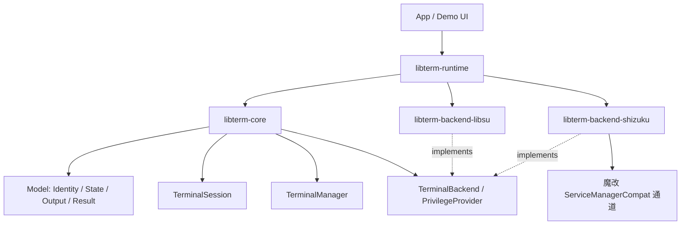
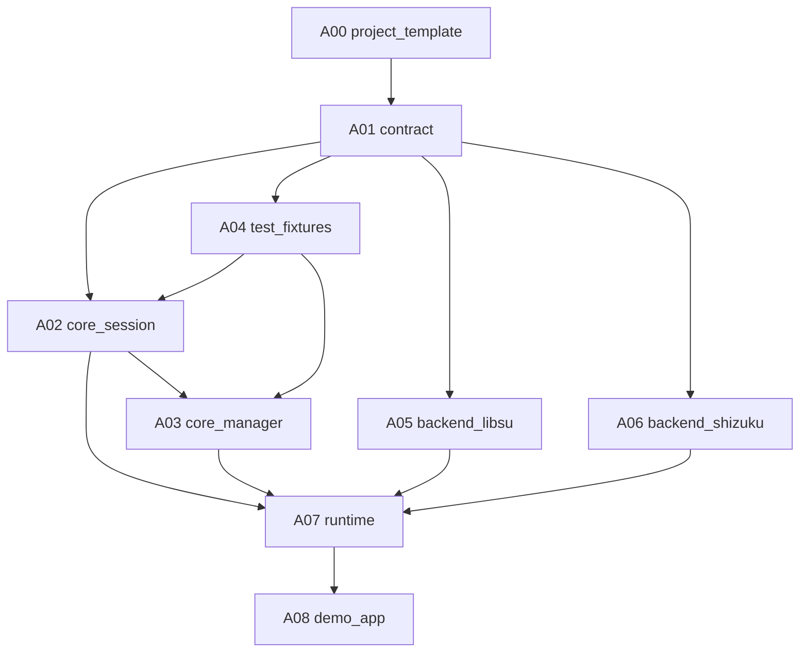

# LibTerm Master ASC

## 1. 总目标

构建 `com.niki914.libterm`：一个 Android 终端管理库。它不是简单的 `Runtime.exec` 包装，而是面向多窗口终端 App 的底层库，提供：

- 多终端会话管理。
- 流式输入/输出。
- 打开终端时显式选择身份：`USER` / `ROOT` / `SHIZUKU`。
- `open()` 返回明确结果，不做自动回退。
- 核心逻辑可脱离 Android 真机做 JVM 单元测试。

## 2. 命名决策

- Kotlin package base：`com.niki914.libterm`。
- Gradle root project：建议 `libterm`。
- Maven group：建议 `com.niki914`。
- Artifact 建议按模块拆分：
  - `libterm-core`
  - `libterm-backend-libsu`
  - `libterm-backend-shizuku`
  - `libterm-runtime`

理由：

- `com.niki914.libterm` 作为包名清晰、短、与现有 `com.niki.cmd` 有继承感。
- Maven artifact 不建议直接叫 `com.niki914.libterm`，否则发布和模块扩展会别扭。
- 对外文档可以统一称为 `LibTerm`。

## 3. 代码落位策略

用户期望：把 `cmdandroid` 的代码直接拷到项目根目录作为项目模板，但 API 全部重做。

建议执行方式：

1. 不在原 `cmd-android-master` 上原地改，避免旧项目污染新 API。
2. 在仓库根目录创建新的 Gradle 项目/模块体系，以 `libterm` 为新产品名。
3. 从 `cmd-android-master` 复制可复用配置、Android library 模板、Shizuku manifest/stub 经验。
4. 旧的 `com.niki.cmd` API 不保留兼容，统一迁移到 `com.niki914.libterm.*`。
5. `ServiceManagerCompat-main` 不作为依赖引入，而是在 Shizuku 后端小 ASC 中复制并魔改所需 Binder/UserService 通道。

## 4. 总架构

## 5. 分层原则

| 层 | 模块 | Android 依赖 | 职责 |
|:---|:-----|:-------------|:-----|
| L1/L2 | `libterm-core` | 无 | 模型、接口、会话、多窗口、测试缝 |
| L3 | `libterm-backend-libsu` | 有 | USER/ROOT 流式 shell 后端 |
| L3 | `libterm-backend-shizuku` | 有 | Shizuku Binder/UserService 流式后端 |
| L4 | `libterm-runtime` | 有 | 默认组装、Facade、对 App 入口 |
| App | `demo-app` | 有 | 示例和体验验证 |

硬约束：

- `libterm-core` 不能依赖 Android SDK 类型。
- `ServiceManagerCompat` 相关 hidden API/stub/libsu/Shizuku 依赖只能存在于 `libterm-backend-shizuku`。
- `TerminalManager` 不做身份回退，只返回 `OpenResult`。
- v1 不做磁盘持久化、不做命令历史、不做 PTY/full-screen TUI。

## 6. 小 ASC 列表

| ID | 小 ASC | 目标 | 依赖 | 并行性 | 任务文件 |
|:---|:-------|:-----|:-----|:-------|:---------|
| A00 | `libterm_project_template` | 从 `cmdandroid` 拷出新项目模板，建立 root project 与模块骨架 | 无 | 串行第一步 | `tasks/A00_libterm_project_template.md` |
| A01 | `libterm_contract` | 固化核心 API 契约、包结构、错误模型、状态模型 | A00 | 串行第二步 | `tasks/A01_libterm_contract.md` |
| A02 | `libterm_core_session` | 实现 `TerminalSession`、输出缓冲、流式状态机 | A01 | 可与 A03/A04 并行 | `tasks/A02_libterm_core_session.md` |
| A03 | `libterm_core_manager` | 实现 `TerminalManager`、open/close/list、多窗口隔离 | A01/A02 接口 | 可与 A02 后半并行 | `tasks/A03_libterm_core_manager.md` |
| A04 | `libterm_test_fixtures` | FakeBackend/FakeProvider/FakeClock 等测试基础设施 | A01 | 可与 A02 并行 | `tasks/A04_libterm_test_fixtures.md` |
| A05 | `libterm_backend_libsu` | USER/ROOT 共用 libsu 流式后端 | A01 | 可与 A02/A03 后期并行 | `tasks/A05_libterm_backend_libsu.md` |
| A06 | `libterm_backend_shizuku` | 魔改 ServiceManagerCompat，做 Shizuku 后端 | A01，建议等 A05 经验 | 后置，高风险 | `tasks/A06_libterm_backend_shizuku.md` |
| A07 | `libterm_runtime` | Facade 与默认依赖组装 | A02/A03/A05 | 后置 | `tasks/A07_libterm_runtime.md` |
| A08 | `libterm_demo_app` | 多窗口 Demo App，验证体验 | A07 | 最后 | `tasks/A08_libterm_demo_app.md` |

## 7. 推荐调度

执行建议：

- 第一阶段串行：A00 -> A01。
- 第二阶段半并行：A02 + A04，随后 A03。
- 第三阶段并行：A05 与 A06 的调研/魔改设计可以并行，但 A06 实现建议后置。
- 第四阶段串行：A07 -> A08。

## 8. 单测策略总则

目标不是“为了脱离真机而脱离真机”，而是把真实业务复杂度放在可控边界内：

- 核心层测试真实业务行为：会话状态、输出缓冲、多窗口隔离、open 失败结果。
- 平台层测试适配行为：libsu/Shizuku 是否正确映射到 `TerminalBackend`。
- 真机测试只覆盖 Android/权限/Binder 的不可替代部分。

每个小 ASC 必须包含：

- 单测目标。
- 至少 5 个边界 case。
- 哪些测试必须是真机/仪器测试，哪些必须是 JVM 测试。
- 不允许用 “mock everything” 掩盖真实状态机行为。

## 9. 当前状态

- Master ASC：已创建。
- 已有前置调研：`../terminal_kit/tech_survey.md`。
- 下一步建议：启动 A00 `libterm_project_template` 小 ASC。

